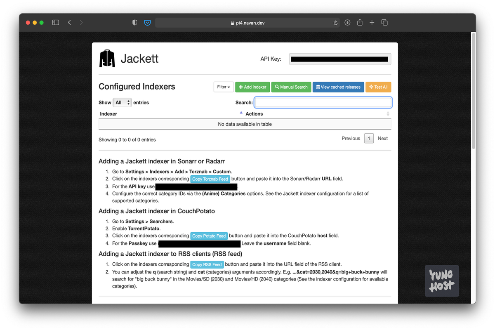

<!--
注意：此 README 由 <https://github.com/YunoHost/apps/tree/master/tools/readme_generator> 自动生成
请勿手动编辑。
-->

# YunoHost 上的 Jackett

[](https://ci-apps.yunohost.org/ci/apps/jackett/)


[](https://install-app.yunohost.org/?app=jackett)

*[阅读此 README 的其它语言版本。](./ALL_README.md)*

> *通过此软件包，您可以在 YunoHost 服务器上快速、简单地安装 Jackett。*  
> *如果您还没有 YunoHost，请参阅[指南](https://yunohost.org/install)了解如何安装它。*

## 概况

Jackett works as a proxy server: it translates queries from apps (Sonarr, Radarr, SickRage, CouchPotato, Mylar3, Lidarr, DuckieTV, qBittorrent, Nefarious etc.) into tracker-site-specific http queries, parses the html or json response, and then sends results back to the requesting software. This allows for getting recent uploads (like RSS) and performing searches. Jackett is a single repository of maintained indexer scraping & translation logic - removing the burden from other apps.


**分发版本：** 0.22.1218~ynh1

## 截图



## 文档与资源

- 上游应用代码库： <https://github.com/Jackett/Jackett>
- YunoHost 商店： <https://apps.yunohost.org/app/jackett>
- 报告 bug： <https://github.com/YunoHost-Apps/jackett_ynh/issues>

## 开发者信息

请向 [`testing` 分支](https://github.com/YunoHost-Apps/jackett_ynh/tree/testing) 发送拉取请求。

如要尝试 `testing` 分支，请这样操作：

```bash
sudo yunohost app install https://github.com/YunoHost-Apps/jackett_ynh/tree/testing --debug
或
sudo yunohost app upgrade jackett -u https://github.com/YunoHost-Apps/jackett_ynh/tree/testing --debug
```

**有关应用打包的更多信息：** <https://yunohost.org/packaging_apps>
